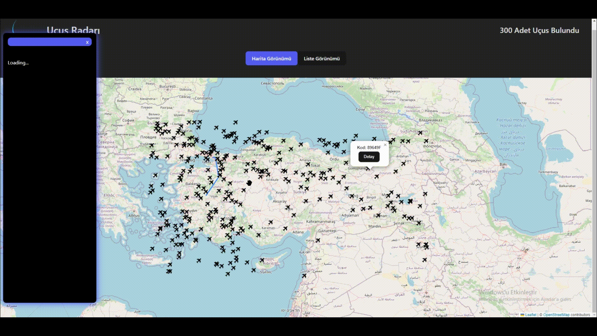

# kaynaklar

api: https://rapidapi.com/apidojo/api/flight-radar1

# kütüphanler
- @reduxjs/toolkit
- react-redux
- thunk(toolkit ile birlikte geliyor zaten)
- axios
- leaflet
- react-leaflet
- react-paginate

# yapılacaklar

- liste görünümü ``ListView.jsx `` bileşeni oluştur
- harita görünümü ``MapView.jsx `` bileşeni oluştur
- app.js de iki bileşen arasında koşullu listeleme ile geçişi sağla

- Sol Alt Enlem Boylam: 34.047182, 24.992627

- Sağ Üst Enlem Boylam: 42.705437, 44.549525

